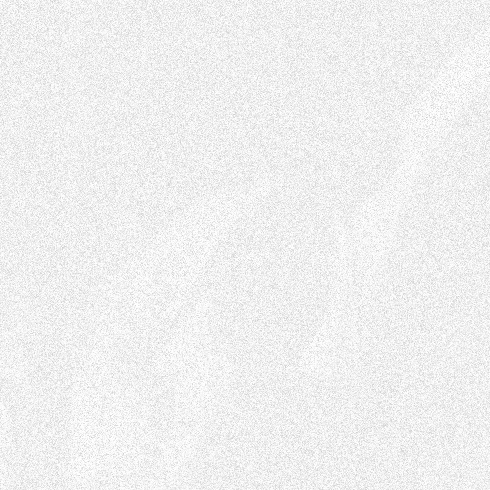

# itools: A set of image-processing tools

itools is a repo containing a set of tools for image processing.

# 1. itools-bayer-conversion.py

This tool converts between different Bayer formats.


# 2. itools-filter.py

This tool provides some image filters, including:
* `gray`: convert image to grayscale.
* `xchroma`: swap chromas (Cb and Cr) in the image.
* `noise`: add noise to the image.
* `diff`: get the diff of 2x images.


Figure 1 shows an example of an image.


## 2.1. `gray` filter

This filter converts an image to grayscale.

Example
```
$ ./python/itools-filter.py --filter gray docs/lena.jpeg docs/lena.gray.jpeg
```


Figure 2 shows the original image after being passed through the `gray` filter.


## 2.2. `xchroma` filter

This filter swaps the chromas (Cb and Cr) in the input image.

Example
```
$ ./python/itools-filter.py --filter xchroma docs/lena.jpeg docs/lena.xchroma.jpeg
```


Figure 3 shows the original image after being passed through the `xchroma` filter.


## 2.3. `noise` filter

This filter adds noise to the input image. The parameter "`--noise-level`" can
be used to add more or less noise.

Example
```
$ ./python/itools-filter.py --filter noise docs/lena.jpeg docs/lena.noise.jpeg
```


Figure 4 shows the original image after being passed through the `noise` filter.


## 2.4. `diff` filter

This filter gets the difference between 2x frames.

The diff algo works as follows: We convert both frames to grayscale (luma-only), and then diff the actual value of each pixel. We calculate the absolute value of the per-pixel difference (`abs[i,j]`), and then set each pixel in the output file (the "diff image" or "diff frame") as 255 minus the absolute value.

The full algo is:

```
# start with in1[i, j] and in2[i, j]
abs[i,j] = abs(in1[i, j], in2[i, j])
out[i,j] = 255 - abs[i,j]
```

Note that the parts where both input file are different is shown in black, while the parts where they are the same are shown in white.


Example
```
$ ./python/itools-filter.py --filter diff -i docs/lena.noise.jpeg docs/lena.jpeg docs/lena.diff.jpeg
```



Figure 5 shows the diff between the original image and the output of the `noise` filter.


# 3. Requirements

* opencv2
* numpy
